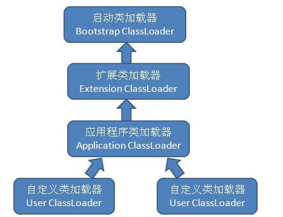

# Java类加载机制

## 过程


* 装载：通过类的全限定名（com.xxx.xxx）获取二进制的class文件，也就是编译后生成的字节码文件，然后将二进制字节流转换成方法区中的运行时数据结构，在堆中生成Java.lang.class对象用来封装类在方法区内的数据结构。这个时候该类型没有被分配内存和没有设置默认值，也没有初始化。
类加载器并不需要等到某个类被“首次主动使用”时再加载它，JVM规范允许类加载器在预料某个类将要被使用时就预先加载它。如果找不到对应的.class文件，则在程序使用该类再报（LinkageError错误），否则不报错。
* 连接：
1. 验证：分为四各阶段，分别验证class文件、java语言等是否符合规范。
2. 准备：为类中的static变量在方法区分配内存，并且设置默认初始值，不是在Java中指定的值。
3. 解析：将符号引用（代表被引用对象的符号）转为直接引用（指针或偏移量等定位的句柄）。
* 初始化：执行<clinit>()方法，这个方法在多线程环境中也能被正确的加锁同步，也就是类的初始化，为static变量赋自己设置的值，有以下两种方法：
a. 声明类变量时指定初始值
b. 在static块中为类变量赋初值
* 使用：执行<init>()方法，创建类的实例对象，存在堆里
* 卸载：
  1. 当所有该类的实例对象都被GC
  2. 该类的classloader已被回收
  3. 该class对象没有在任何地方被引用

### 类的加载场景

当一个类被加载之后就不再需要加载

1. 遇到 ```new``` 关键字来实例化对象；读取或者设置一个静态字段（常量池除外）；调用静态方法
2. 反射调用类
3. 加载一个类先初始化该类的父类
4. 虚拟机启动时加载包含main方法的类
5. 动态代理中与静态变量及方法相关的句柄被解析

## 类加载器

类加载器将class文件字节码内容加载到内存中，并将这些静态数据转换成方法区中的运行时数据结构，在堆中生成一个java.lang.Class类的实例对象，作为类元数据。

1. 根类加载器（bootstrap class loader）:它用来加载 Java 的核心类，是用原生代码来实现的，并不继承自 java.lang.ClassLoader（负责加载$JAVA_HOME中jre/lib/rt.jar里所有的class，由C++实现，不是ClassLoader子类）。
2. 扩展类加载器（extensions class loader）：它负责加载JRE的扩展目录，lib/ext或者由java.ext.dirs系统属性指定的目录中的JAR包的类。由Java语言实现，父类加载器为null。
3. 系统类加载器（App class loader）：被称为系统（也称为应用）类加载器，它负责在JVM启动时加载来自Java命令的-classpath选项、java.class.path系统属性，或者CLASSPATH换将变量所指定的JAR包和类路径。程序可以通过ClassLoader的静态方法getSystemClassLoader()来获取系统类加载器。如果没有特别指定，则用户自定义的类加载器都以此类加载器作为父加载器。由Java语言实现，父类加载器为ExtClassLoader。
4. 自定义类加载器：自定义的类加载器继承自ClassLoader，并覆盖findClass方法（不打破双亲委派）覆盖loadclass方法可以打破双亲委派，它的作用是将特殊用途的类或者其他目录的类加载到内存中。父加载器为AppClassLoader。
### 双亲委派模型


双亲委派机制是一种类似于递归的加载机制，伪代码如下：

```java
public Class load(){
	if(parent.load().exist()){
		return parent.load();
	}
    if(class.exist()){
        this.dosomething();
        return class;
    }else{
        //父类查不到再用子类加载
        //指定的最下层加载器才会抛出这个异常
        throw ClassNotFountException;
    }
}
```

## Q&A

1. 为什么使用双亲委派机制？

   类加载器负责加载所有的类，其为所有被载入内存中的类生成一个java.lang.Class实例对象。一旦一个类被加载如JVM中，同一个类就不会被再次载入了。在Java中，一个类用其全限定类名（包括包名和类名）作为标识；但在JVM中，一个类用其全限定类名和其类加载器作为其唯一标识。为了防止产生重复加载多个class而无法保证唯一性，导致虚拟机运行失败，还能防止核心API库被随意篡改。

2. Class.forName(全限定名) 和 new ClassLoader.loadClass(全限定名)有什么区别？

   Class.forname():是一个静态方法,最常用的是Class.forname(String className);根据传入的类的全限定名返回一个Class对象.该方法在将Class文件加载到内存的同时,会执行类的初始化.
   ClassLoader.loadClass():这是一个实例方法,需要一个ClassLoader对象来调用该方法,该方法将Class文件加载到内存时,并不会执行类的初始化,直到这个类第一次使用时才进行初始化.该方法因为需要得到一个ClassLoader对象,所以可以根据需要指定使用哪个类加载器.
   
3. class.forname(全限定名)和Object.getClass()以及类名.class的区别？

   class.forname(全限定名)将类加载，并执行初始化。

   Object.getClass()，返回对象真正的类。

   类名.class在类没有被加载的时候使用，不进行初始化

   

# Java对象

## 创建对象的方法

1. new
2. clone
3. 反射
4. 反序列化

**过程**：

1. 先检查常量池中有没有对应的符号引用，再检查这个类是否被加载。
2. 分配内存：**指针碰撞法**，在分界点处向未分配方向移动对象要求大小，需要内存规整。**空闲列表法**，记录可用的内存块及大小。
3. 并发创建对象：a、使用CAS＋失败重试的方式保证分配+更新的原子性。b.、每个线程预先分配一块独立的内存，叫TLAB，线程本地分配缓存。

## 对象结构


1. **对象头**

+ **Markword**

  第一部分markword,用于存储对象自身的运行时数据，如哈希码（HashCode）、GC分代年龄、锁状态标志、线程持有的锁、偏向线程ID、偏向时间戳等，这部分数据的长度在32位和64位的虚拟机（未开启压缩指针）中分别为32bit和64bit，官方称它为“MarkWord”。

+ **klass**

  对象头的另外一部分是klass类型指针，即对象指向它的类元数据的指针，虚拟机通过这个指针来确定这个对象是哪个类的实例。通过RTTI（运行时类型识别）来实现多态

+ **数组长度（只有数组对象有）**

  如果对象是一个数组, 那在对象头中还必须有一块数据用于记录数组长度。

2. **实例数据**

   实例数据部分是对象真正存储的有效信息，也是在程序代码中所定义的各种类型的字段内容。无论是从父类继承下来的，还是在子类中定义的，都需要记录起来。

3. **对齐填充**

   对象起始地址要求必须是8字节的整数倍，若对齐就不需要这部分。

# 代理

## JDK Proxy

概述：基于代理类和被代理类实现同样的接口，那么代理类和被代理类方法名就一样

### 1. 静态代理

程序员实现代理类（实现被代理类的接口，同时持有被代理类的一个实例对象）和代理工厂类，程序使用工厂类提供的代理类实例就能调用被代理对象的方法。代理类调用被代理类的方法时，可以在方法执行前和执行后添加自己的额外功能。

优点：

缺点：接口增加方法之后，需要在代理类也添加新的实现，增加了代码量。

### 2. 动态代理

顾名思义就是由程序动态的生成代理类，而不需要程序员自己实现。

动态代理过程：

1. 先定义好要实现的接口，并且创建好接口的实现类，也就是被代理对象。

2. 实现一个InvocationHandler接口如下：

   ```java
   public class InvocationHandlerImpl implements InvocationHandler
   {
       // 被代理的真实对象
       private Object readSubject;
       
       public InvocationHandlerImpl(Object subject)
       {
           this.subject = subject;
       }
       
   	public Object invoke(Object proxy, Method method, Object[] args) throws Throwable{
           doSomethingBefore();
           Object returnValue = method.invoke(subject, args);
           doSomethingAfter();
           return returnValue;
       }
   }
   ```

3. 生成代理对象：

   首先创建被代理对象实例和InvocationHandler实例：

   ```java
   Subject realSubject = new RealSubject();
   
   InvocationHandler handler = new 		        InvocationHandlerImpl(realSubject);
   ```

   因为代理对象要和被代理对象实现了同样的接口，而且要用同样的类加载器，所以通过**反射**来获得：

   ```java
   ClassLoader loader = realSubject.getClass().getClassLoader();
   Class[] interfaces = realSubject.getClass().getInterfaces();
   ```

   然后获得代理类实例：

   ```java
   Subject subject = (Subject) Proxy.newProxyInstance(loader, interfaces, handler);
   ```

   深入这个方法，发现通过传入接口数组和类加载器生成了动态代理类的类信息，然后反射调用构造函数生成了代理类的实例对象，类名是（接口名+$Proxy+自增数字）。

   在程序中使用动态代理对象来调用被代理类的接口的方法。

   ```java
   subject.method();
   ```

   动态代理类实例中会持有一个InvocationHandler实例，再通过InvocationHandler的invoke方法调用被代理类的具体方法。动态代理类也实现了接口的方法，然后每个方法内部调用handler的invoke方法，添加不同的方法参数。

## Cglib

概述：**动态字节码增强技术**。CGLIB包的底层是通过使用一个小而快的字节码处理框架ASM，来转换字节码并生成新的类。所以被代理类不能被final修饰，代理类去继承目标类，然后重写目标类的方法，也能保证代理类拥有被代理类的同名方法。

使用过程：

1. 必须实现MethodInterceptor(方法拦截器)接口

   ```java
   package net.sf.cglib.proxy;
   
   public interface MethodInterceptor
   extends Callback
   {
       public Object intercept(Object obj, java.lang.reflect.Method method, Object[] args,MethodProxy proxy) throws Throwable;
    
   }
   ```

   这个接口只有一个intercept()方法，这个方法有4个参数：

   1）obj表示增强的对象，即实现这个接口类的一个对象，也就是代理类对象；

   2）method表示要被拦截的方法；

   3）args表示要被拦截方法的参数；

   4）proxy表示要触发父类的方法对象；

   ```Object object = methodProxy.invokeSuper(obj, args);```这句代码实现了调用被代理对象的方法。

   invokeSuper调用的是已经增强过的方法，invoke调用没有增强过的方法

2. 创建代理对象:

   ```java
   Enhancer enhancer = new Enhancer();
   // 设置enhancer对象的父类
   enhancer.setSuperclass(RealSubject.class);
   // 设置enhancer的回调对象,这个就是第一步接口的实现类
   enhancer.setCallback(new MyMethodInterceptor());
   // 创建代理对象
   RealSubject proxy= (RealSubject)enhancer.create();
   proxy.dosomething();
   ```

   通过反编译代码分析，生成了一个继承被代理类的子类，并且子类实现了Factory接口。代理类中持有一个拦截器实例，还有常量字段来存method和methodproxy以及参数数组，这些字段会被用于拦截器的intercept方法，从而实现增强被代理类的方法。

### FastClass

FastClass不使用反射类（Constructor或Method）来调用委托类方法，而是动态生成一个新的类（继承FastClass），向类中写入委托类实例直接调用方法的语句，用模板方式解决Java语法不支持问题，同时改善Java反射性能。

动态类为委托类方法调用语句建立索引，使用者根据方法签名（方法名+参数类型）得到索引值，再通过索引值进入相应的方法调用语句，得到调用结果。

**性能对比**：JDK高版本执行反射时引入了通胀概念，当一段反射逻辑执行次数超过阈值就会生成被反射类对应的字节码反射器，加快反射调用，甚至比cglib还快。两种方法都会生成新的类占用方法区。

## AspectJ

**概述**：AspectJ在java的基础上提供了全新的语法实现，也是一种静态代理的方式。动态代理和Cglib都是动态运行时织入。AspectJ是一种静态编译织入，在编译成class字节码的时候在方法周围加上业务逻辑。复杂的工作由特定的编译器帮我们做。

# 反射

## 概述

在运行时，对于任何一个类都能获取到他的所有属性和方法，对于任何一个对象都能都调用它的任意一个方法和属性。这种动态获取的信息及动态的调用称为反射。

## 使用

使用反射机制，必须得到该类的字节码文件对象（.class），通过字节码文件对象就能获取类的信息。

获取字节码文件对象的方法：

1. Class clazz1 = Class.forName("全限定类名"); // 这时类还是源文件阶段，没有变成字节码文件
2. Class clazz2 = Person.class; // 类已经被加载器加载成为字节码文件
3. Class clazz3 = p.getClass(); // 通过对象实例获取

## 缺点

反射机制破坏了类的封装，也无视访问权限。

## api

### getFields()、getDeclaredFields()和getSuperClass()的区别

getFeilds：获得本类及其实现和继承的所有public变量。

getDeclaredFields：获得本类所有自己声明的变量（包括四种修饰类型）。

getSuperClass：获得本类的父类的class对象。

### getModifiers

以整数形式返回该方法或者成员变量的修饰符

### 反射修改静态常量

```java
Field modifiers = Field.class.getDeclaredField("modifiers");
// 修改访问权限
modifiers.setAccessible(true);
modifiers.setInt(field, field.getModifiers() & ~Modifier.FINAL);
// 如果变量是不可访问的，还需要
// field.setAccessible(true);
// 如果是类变量，那么第一个参数是null，如果是成员变量，那么第一个参数是对象引用
field.set(null, 520);
```

