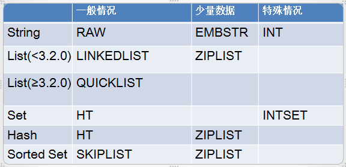
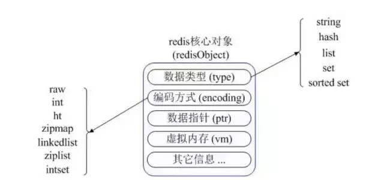

# Redis

## 基础特性

### 数据类型type

字符串：一个key对应一个string。

hash：一个key对应一个 map。

list：string列表（双向链表），按插入顺序排序，可以从左边也可以从右边插。也可以从两端访问。使用场景：缓冲队列，按时间排序的内容。

set：string的无序不可重复的集合。是一个value永远为null的hashmap。使用场景：求交集并集差集

zset：string的有序不重复集合。每个元素都有一个double类型的分数，分数可以重复。内部元素按分数排序。底层实现是**跳跃表**。score相同的时候使用字典序排列。

hyperLogLog（不精确的去重统计方案）：用来统计基数的数据结构。使用用户ID作为key，记录可以记录用户登录次数。统计网页访客UV，将cookie或者ip作为值。占用空间为12K，稀疏矩阵->稠密矩阵

### 编码方式encoding



ziplist：当**hash**和**zset**数据较少时，使用ziplist来编码。查找数据需要遍历列表。通过**存储当前节点长度和上一个节点长度**实现了双向的遍历，不用指针。**连锁更新**：当上一个节点长度小于254字节时，用一个字节存长度，否则要用5个字节存储。第一个字节存储255时，则证明已到达末端。当一个节点长度在250-253之间，next节点记录pre长度为1，当在这些节点之前插入一个长度大于253的节点，就会引发后续节点的长度更新。删除时也有可能导致，删除了一个小的，导致pre节点长度大于253。**插入删除操作**：后续所有的节点在连锁更新的基础上都要移动到指定位置。

intset：存储整数集合并且数据量较小的情况下Redis会使用intset作为set的底层实现，是一个有序数组，查找效率为logn。

embstr：当字符串长度小于设定值（默认64），会将字符串SDS与redisObject的内存分配到一起。减少内存分配从两次到一次。

hashtable：数组+size+used+掩码（size-1），字典中有两个这样的table，其中一个用于rehash。**渐进式rehash**：将rehash过程分摊到每个对字典的增删改查中，使用rehashidx记录rehash过程，-1表示rehash结束，0表示开始，正数表示有多少键已被迁移。使用**链地址法**解决hash冲突。

Raw：SDS结构体，记录字符串长度、剩余空间长度以及字符数组。每次扩容分配1MB大小。可以有空格，不会有缓冲区溢出、减少内存分配次数。Raw将SDS和redisObject分别分配内存空间。

quicklist：由ziplist组成的双向链表，每个ziplist大小有限，只能装几个值



### 过期删除策略

相比缓存淘汰是由于使用内存到上限而被动删除，这个是主动删除。

1. **定时删除**：为每个key设置定时器监听是否过期，非常消耗cpu资源
2. **惰性删除**：当系统访问到key判断该key已经过期，再删除key，会浪费内存资源
3. **定期删除**：把有过期时间的key放到一个字典中，定期扫描，删除过期key

Redis中同时使用了惰性过期和定期删除两种过期策略。

### 缓存淘汰机制

特指在redis内存使用超过一定值的时候使用的淘汰策略。

**volatile-lru** 从已设置过期时间的数据集中挑选最近未使用的数据淘汰
**volatile-ttl** 从已设置过期时间的数据集中挑选将要过期的数据淘汰
**volatile-random** 从已设置过期时间的数据集中任意选择数据淘汰
**volatile-lfu**从所有配置了过期时间的键中驱逐使用频率最少的键 
**allkeys-lru**从所有数据集中挑选最近最少使用的数据淘汰
**allkeys-random**从所有数据集中任意选择数据进行淘汰          
**allkeys-lfu**从所有键中驱逐使用频率最少的键
**noeviction**禁止驱逐数据

## 底层原理

### redis为什么速度快

#### 1.多路io复用机制

I/O是指网络I/O,多路指多个TCP连接(即socket或者channel）,复用指复用一个或几个线程。意思说一个或一组线程处理多个TCP连接。最大优势是减少系统开销小，不必创建过多的进程/线程，也不必维护这些进程/线程。

原始的思路是将一个线程处理一整个网络请求，每当有新的请求就会创建新的线程来处理，这样会有创建和销毁线程的开销。

**Reactor模式** 将网络请求分为更小的粒度：**连接**、**读取**、**写入**。有个全局selector检测各个通道有没有事件发生，有事件发生就调用相应的handler线程来处理，处理之后可以继续处理其他的请求。节约了线程的开销。

#### 2.单线程

#### 3.数据都在内存中

### 缓存穿透及缓存雪崩

**缓存穿透**：恶意查询不存在的key，强制让大量查询转发到后端数据库。

解决方法：

* 对查询结果为空的情况也缓存，这样的问题是可能会导致Redis中无效数据特别多，可以设置一个较短的过期时间来优化
* 将数据库所有的查询条件，放入bitmap或布隆过滤器（redis自带）中，这样当不存在的请求被发来时，布隆过滤器直接将请求返回。
* 代码中增加校验

**缓存击穿**：在缓存过期的短时间内大量查询，导致数据库访问增加。

解决方案：设置热点数据永不过期。

**缓存雪崩**：大量缓存同时到期，导致数据库访问骤增。

解决方法：将缓存时间设置为随机值，在原有时间上按范围波动

## 数据一致性

**强一致性**：更新过的数据都能被后续的访问看到

**弱一致性**：更新过的数据不能被部分后续访问看到

**最终一致性**：经过一段时间后能够访问过更新过的数据，给缓存设置过期时间，就能保证最终一致性，要求更新数据库的操作必须完成，对缓存则不强制要求完成

### 延迟双删

1. 先删除缓存
2. 再更新数据库
3. 延迟一段时间再删除缓存（防止更新数据库的二次删除缓存，发生在读到旧值的事务更新缓存之前）

## 持久化

### RDB

redis database，将数据生成快照保存到硬盘中，生成时过期的键不会被放入RDB文件中。

**触发方式**

1. **手动触发**：

   * save：进行同步操作，将数据快照以rdb格式存储在磁盘上，阻塞主线程，这个过程客户端无法连接redis。
   * bgsave：redis fork出一个子进程，原来的redis进程继续处理客户端请求，子进程负责将数据保存到磁盘。lastsave指令可以判断bgsave是否成功。使用**写时复制**方式，减少资源开销，子进程读父进程的空间然后写入快照文件，父进程有数据修改时，子进程只能共享fork时刻的数据空间，**新的命令写入不会持久化**。

2. **自动触发**：

   save n m：redis在n秒内如果超过m个key被修改就自动做快照

**优点**

* 数据库只有一个rdb备份文件，全量复制，并且方便移动到其他介质上
* 恢复大数据集时比AOF更快
* 父进程不需要进行磁盘io，交给子进程即可

**缺点**

* 无法及时快照保存，导致在某个时间段内的数据丢失
* 新老版本rdb二进制文件格式不兼容

### AOF

Append Only File，将每个写命令都通过write函数追加到appendonly.aof文件中。当Redis重启时，会执行文件中的写命令来重建整个数据库的内容。配置appendonly yes，开启aof。

**过程**

1. **命令写入**：将日志写入AOF缓冲区

2. **文件同步**：根据不同的模式，调用os的fsync将数据从内存写入到磁盘，分为每条写命令写入，每秒写入和根据os自己决定写入。三种方式性能有坏到好，持久化安全性由高到低。

3. **文件重写**：把**redis进程的数据转化为写命令**同步到新AOF文件的过程，用新的AOF文件代替旧的文件。redis fork出一个子进程，子进程带有父进程在该时刻的快照，根据快照生成新的AOF文件，然后改名代替旧的。这个时间段内会产生一个**临时的AOF重写缓存**，当主进程执行完写命令后，将写命令追加到缓存中。子进程重写完成后，将AOF缓存的内容写入到AOF文件中。重写时不会记录检查到过期的键。解决了记录日志内容太多的问题。

   **触发方式**：

   * 手动触发：bgrewriteaof
   * 自动触发：aof_rewrite_min_size 根据AOF文件大小阈值，auto-aof-rewrite-percentage 根据AOF文件增长比例。

4. **重启加载**：先查看是否开启AOF，没有的话再去检查RDB是否存在。当加载到过期数据时，AOF中已过期的键不会被加载，RDB中的过期键如果是主服务器就删除，否则就等待同步主服务器后再删除。

**优点**

* 持久化更及时
* 更容易被人读懂

**缺点**

* AOF文件更大

## redis 实现分布式锁

分布式锁适用于给多个分布在不同设备上的进程访问共享资源时加锁。

**要求**

1. 互斥性
2. 不会发生死锁，即使加锁客户端崩溃也不会导致锁无法释放
3. 容错性，有redis节点正常运行，客户端就可以加解锁
4. 加解锁必须是同一个客户端进行

使用命令setnx来实现加锁，用expire设置解锁时间。但是由于两个操作不是原子性的，所以可能设置了锁，没有设置过期时间。

**正确加锁**

```redis
 SET resource_name my_random_value NX PX 30000
```

可以根据value来判断是不是自己的锁，实现可重入以及正确的删除。

**正确解锁**

使用lua脚本判断是否是自己加的锁，如果是则删除。不能使用非原子的判断和del，防止错误删除其他人的锁。

**RedLock**

问题：当应用在主从部署的redis中，如果加锁结果还没有被master写入slave，master就挂掉，slave竞争成为新的master，锁就丢失了。

解决：假设分布式环境中有N个Redis Master，这些节点**完全互相独立，不存在主从复制或者其他集群协调机制**。客户端申请锁，记录当前时间，向N个master一次使用相同的key和uuid获取锁，根据相应结果和超时来判断。当一半以上的锁被获取到，并且这个时候锁没有过期，则认为获取成功。获取失败应该在所有的master上解锁，

## 主从、哨兵

主从配置结合哨兵模式能解决单点故障问题。

### 主从复制

使用psync命令，从节点根据runId指定主节点进行全量或者增量复制。复制的同时会将当前的写命令记录在复制缓冲区中，等复制结束后再次复制。

### 哨兵

多个哨兵同时监控所有的主从节点，当主节点下线时，哨兵进行确认，确认后对从节点发信息，然后根据反馈信息，选举一个新的主节点，其他从节点根据新的主节点进行复制。当主服务器重新向 Sentinel 的 PING 命令返回有效回复时，主服务器的主观下线状态就会被移除。

## memcached比较

memcached是多线程处理，只支持key-value，redis支持持久化。

## 其他

1、redis 大Key问题

**表现**：某个key对应的value内容非常多，如粉丝列表、热门评论。

**影响**：在经过分片后的集群模式中，某个热门big key可能导致**访问量倾斜**，请求都落在这个redis实例上，也会导致**数据倾斜**，导致某个redis实例内存不足。如果有big key的删除或者自动过期，会严重影响性能，甚至阻塞服务，影响主从同步。

**定位**：**redis-rdb-tools**，分析rdb文件。**bigkeys**命令，能够找到五种类型较大key，string类型根据长度判断，其他类型通过field数量判断，可能不准确。

**解决**：使用**memory usage**抽样方法计算整个key大小。**lazyfree**在删除时只进行逻辑删除，使用子线程（BIO）删除。也可以对key进行拆分，分布在多个redis实例上。